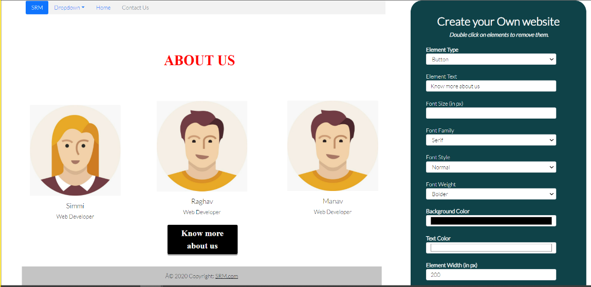
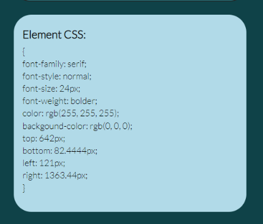

# TRINIT_SRM_DEV01
Drag and drop elements to create a website

**TEAM NAME:** SRM  
**PROBLEM STATEMENT:** DEV_01  
**TECH STACKS USED:** html, CSS+Bootstrap, vanilla Javascript  

**VIDEO LINK:** https://drive.google.com/file/d/1YrBRMeSnEDHQ9f-8MGNwW_BOm0quqiP_/view  
**PROJECT LINK:** https://github.com/manavagr1108/TRINIT_SRM_DEV01  
**Github Pages LINK:** https://manavagr1108.github.io/TRINIT_SRM_DEV01/  

**INTRODUCTION:**  
Develop a solution through which a person can create a website just by dragging and dropping elements.  
 
**PROPOSED METHOD:**  
-build a basic website using our web app  
-components include navbar, footer, cards, images and other basic html elements.  
-**FUNCTIONALITY:**  
    • User can choose from a number of components which he can drag around the screen and place them according to their requirements. 
    • Single Click displays the CSS style of the chosen element. 
    • Double Clicking on an element removes it. 
    • Hovering on certain elements like buttons, cards will trigger hover and click animations. 
    • Blue highlight border displays the element that the cursor currently points to. 
-**METHOD:** 
    • Generation of new elements is done by appending children in the userbody div. 
    • Dragging and dropping of elements is implemented using dragElements function, which basically gets the cursor position and as  the mouse is dragged it reassigns the top and left attributes of the element. 
    • To generate advanced components like navbar, card, footer: we have used bootstrap classes and appended them in the same way as  other basic HTML elements. 
**WORK DONE:** 
 
 

**CONCLUSION:** 
Our site can be used by a novice web developer to build his own website by dragging and dropping elements to the main screen, styling  them according to his requirements and also generating corresponding CSS. 
 
**REFERENCES:** 
https://www.w3schools.com/js/default.asp 
https://startbootstrap.com/themes 
https://stackoverflow.com/questions/6860853/generate-random-string-for-div-id/6860962 